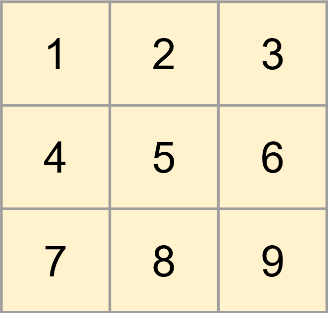
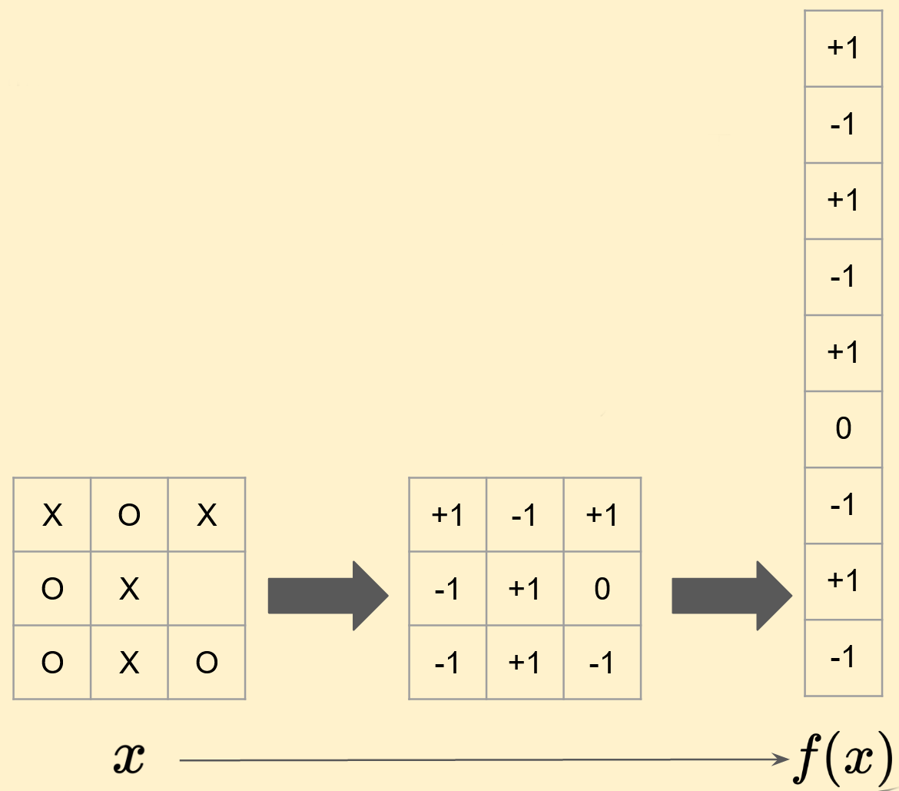

# Linear-Quadratic Embedding of Finite Dynamic Games #
## Analysis ##
<link rel="stylesheet" href="https://cdn.jsdelivr.net/npm/katex@0.10.2/dist/katex.min.css" integrity="sha384-yFRtMMDnQtDRO8rLpMIKrtPCD5jdktao2TV19YiZYWMDkUR5GQZR/NOVTdquEx1j" crossorigin="anonymous">

### Linear Embeddability of Games ###
Not all games are linear embeddable. In fact most games are not. In this chapter, we present a wide subclass of games which are not linearly embeddable.

Suppose that the our game has finite state space $$X$$ and suppose that $$a,b,c,d,e,\in X$$. Now suppose that this game has distinct actions $$u,v\in U = \prod_i U^i$$. Then if we have the following dynamics:

- $$a \rightarrow^u b$$
- $$c \rightarrow^u b$$
- $$a \rightarrow^v d$$
- $$c \rightarrow^v e$$

Then the game is not linearly embeddable since if it were, the first two dynamics above would yield

$$
\mathbf{A} (f(a) - f(c)) = 0  
$$

But from the last two dynamic we have

$$
\mathbf{A} (f(a) - f(c)) = f(d) - f(e)   
$$

Therefore $$f(d) = f(e)$$. Which contradicts our requirement of the embedding functions to be injective. In other words, if anywhere in the game there are two states which map to the same state under the same action, then if those states map to different states under different actions then the game is not linearly embeddable. notice that this immediately eliminates a large class of games.

Notice that despite the above result limits the number of linearly embeddable games significantly, our example game tic-tac-toe is still linearly embeddable. Indeed we can find a linear embedding for it. To do this we first enumerate each cell as follows:

After this enumeration, to embed the game state into a state in 9-dimensional Euclidean space, we can simply flatten the tic-tac-toe table into a 9 long vector. The following image shows an example of this process.

After this, the control actions can also be embedded in a similar way. That is, the action of playing a move in cell $$i$$ can be mapped to a one-hot vector that is the standard unit vector pointed towards the $$i$$'th axis in the 9-dimensional Euclidean space in which we have mapped the states. For example, if $$u$$ is the action of moving an "X" or "O" in cell $$3$$, then $$g^j(i) = [0,0,1,0,0,0,0,0,0] $$. Under this embedding, it is easy to check that

$$
f(x_{t+1}) = f(x_t) + g^1(u^1_t) - g^2(u^2_t)
$$

Which is a linear embedding of tic-tac-toe. In the following page, we also show how this embedding affects the rewards of the tic-tac-toe game, and then show that this embedding is not an LQ embedding.

### One-Hot Embeddability of Games ###

[Previous page](problem.md) | [Next page](results.md)

[Home](README.md)
