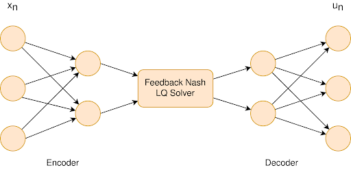

# Linear-Quadratic Embedding of Finite Dynamic Games #
## Results ##
We have used Python for the experiments. Below are the empirical results to give evidence to our claim that the tic-tac-toe game is not LQ embeddable.

For our results we have first implemented a simple terminal based tic-tac-toe game. Here the player 1 plays X's and player 2 plays O's and the first player who can get three in a row, diagonals included, wins the game. If all cells are filled up and there are no winners, the game is drawn. In our implementation a human player can input moves by pressing the key in the keypad corresponding to the cell in the 3 by 3 tic-tac-toe grid. Here is an example board for the tic-tac-toe game.

We have implemented two different empirical analysis methodologies to show the difficulty of embedding tic-tac-toe into an LQ game.

### Neural Network Results ###
We have trained a simple feed forward neural network to embed our the tic-tac-toe game into an continuous time LQ game. To do this, we used an auto-encoder-like network with an LQ solver placed between the encoder and decoder. The network was then trained with a loss function defined as cross entropy loss between the control (move) output of the network and "correct" control outputs generated by a Monte Carlo Tree Search (MCTS) algorithm. A pictorial representation of the neural network is as follows.

The performance of the trained network against a true MCTS algorithm yielded abysmal results. In 1000 games with the neural network as player 1 (X's) and MCTS as player 2 (O's) resulted in around 15% player 1 wins, around 45% draws and around 40% player 2 wins. Clearly, the neural network approach does not work. We were unable to improve this result significantly by hyperparameter tuning. The following results shed light to a potential reason form this failure.

### PCA analysis ###
In the previous section we have shown that the tic-tac-toe is linearly embeddable. However, we were unable to show that it is also LQ embeddable. In this section we provide evidence for tic-tac-toe not being LQ embeddable. To do this, we show that the game rewards of the tic-tac-toe are not separable using ellipsoids. This means that there are no quadratic form

$$
c_i(t, x, u_1, \dots, u_N) = \frac{1}{2}\bigg(f(x)^\top Q_t^i f(x)
$$

which is approximately consistent with the finite game rewards. Notice that we have excluded the control rewards from the above expression since the rewards of tic-tac-toe (win = +1, lose = -1, neither win nor lose = 0) are only dependent on game states.

We have simulate 10000 games using the simple tic-tac-toe embedding we have described in the previous section. We have then colored each point corresponding to an embedded game state with the winner associated with that state, and then projected the resulting points into the two axes which show largest covarience between different simulkated game states. These axes are sometimes called the principle axes (See [this library](https://scikit-learn.org/stable/modules/generated/sklearn.decomposition.PCA.html) for more explanation on PCA analysis) The following plot is the resulting PCA plot.

As can be seen in the above plot, the state rewards do not seem to be quadratically separable, since the no-winner states cannot be separated from the other states.

---

